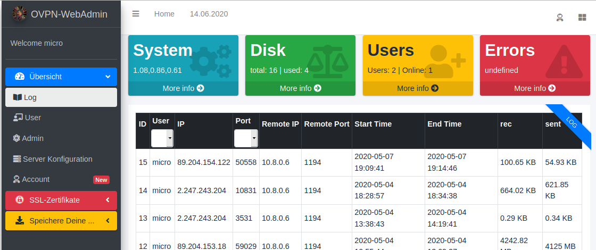

# OpenVPN WebAdmin 1.2.0

You lock your front door. But why do you leave the back entrances open? This is the same with almost all Internet accesses to your IoT, webcams and other devices.

Create and manage your virtual private network via web browser and OpenVPN. This system is a simple and easy method for your private user manager. The system is suitable for families, shared flats or companies that value free software. If you want to become independent from big cloud providers, if you really care about the security of your data without having to reveal the communication to secret services or data collectors, you will find your way with this system.


[](https://twitter.de/HuWutze)
[](https://liberapay.com/Wutze/)

## Extended documentation

[](doc/doc.en_EN.md)
[](doc/doc.de_DE.md)

[](doc/update-to-1.2.0.info.md)

## Screenshots

Administrate its OpenVPN with a web interface (logs visualisations, users managing...) with MariaDB.





## Prerequisite

* GNU/Linux with Bash and root access
* Fresh install of OpenVPN
* Web server (NGinx, Apache...)
* MariaDB (see note MySQL)
* PHP >= 7.x with modules:
  * zip
  * mysql
* yarn
* unzip
* wget
* sed
* curl
* git
* net-tools (for the includes simple firewall)

Only __CentOS__

* tar

## Note MySQL

If you already have a database server, you can also use this one and do not need to install one locally. You only need a database and a username and password

## Manual Install with MySQL-Server (Debian)

````bash
apt-get install openvpn apache2 php-mysql mariadb-server php-zip php unzip git wget sed curl net-tools -y
apt-get install npm nodejs -y
npm install -g yarn
````

## Manual Install without MySQL-Server (Debian)

````bash
apt-get install openvpn default-mysql-client apache2 php-mysql php-zip php unzip git wget sed curl net-tools -y
apt-get install npm nodejs -y
npm install -g yarn
````

## Manual Install with MySQL-Server (CentOS)

````bash
yum install openvpn apache2 php-mysql mariadb-server php-zip php unzip git wget sed curl net-tools tar -y
yum install npm nodejs -y
npm install -g yarn
````

## Manual Install without MySQL-Server (CentOS)

````bash
yum install openvpn default-mysql-client apache2 php-mysql php-zip php unzip git wget sed curl net-tools tar -y
yum install npm nodejs -y
npm install -g yarn
````

## Tested on

* Debian 10/Buster, PHP 7.3.x, 10.3.22-MariaDB.
* RaspberryPi 4 with Debian Buster
* ~~Ubuntu 20.04 Server (Minimal Installation + OpenSSH-Server)~~
* CentOS (view issue #19)

Feel free to open issues. <https://github.com/Wutze/OpenVPN-WebAdmin/issues>

## Installation

* Setup OpenVPN and the web application:

````code
cd /opt/
git clone https://github.com/Wutze/OpenVPN-WebAdmin openvpn-admin
cd openvpn-admin
cp config.conf.sample config.conf

# Edit your config.conf e.g. with nano
nano config.conf

# Beginn main installation
./install.sh
````

* Setup the web server (Apache, NGinx...) to serve the web application. Using the example below.

````code
nano /etc/apache2/sites-enabled/[ apache config ]
````
  
* You must reboot the server after installation, otherwise the vpn server will not start correctly and no connection will be established!

* Finally, create a port forwarding on your Internet Router to this VPN-Server. Check the documentation of the router manufacturer or search the Internet for instructions.

## Update

Change to the original installation folder _/opt/openvpn-admin_

````bash
cd /opt/openvpn-admin
git pull
bash ./update.sh
````

Follow the instructions

## OpenVPN-Clients and Documentation to install

### Apple iOS

* <https://apps.apple.com/us/app/openvpn-connect/id590379981>
* Documentation (German) <https://www.thomas-krenn.com/de/wiki/IOS_11_als_OpenVPN_Client_konfigurieren>

### Android

* <https://play.google.com/store/apps/details?id=de.blinkt.openvpn&hl=de>
* Go to download, download the zip file, unzip it into a separate folder, open the OpenVPN app and download the client.conf. Everything else happens automatically. Enter the password and you are ready to go.

### Windows 10

* <https://openvpn.net/client-connect-vpn-for-windows/>

The full functionality of OpenVPN under Windows 10 can unfortunately only be achieved by running the program under admin rights. This applies in particular to the routing into the VPN network, which does not work without admin rights. Additionally, the client version 3 of OpenVPN is in my opinion not usable to its full extent. For this reason I recommend, especially for people who want to know what they are doing and also want to adjust the configuration, the old version 2. Here is the direct link. <https://openvpn.net/downloads/openvpn-connect-v2-windows.msi>

### all

Looks at the configuration of the VPN app. If necessary, adjust the address of your gateway to the VPN server. Most routers can handle a free Dyn-DNS, so you only have to give the name, no IP address.

## Apache Example

````conf
<VirtualHost *:80>

        ServerAdmin webmaster@localhost
        DocumentRoot /srv/www/openvpn-admin

        ErrorLog ${APACHE_LOG_DIR}/error.log
        CustomLog ${APACHE_LOG_DIR}/access.log combined

AccessFileName .htaccess
<FilesMatch "^\.ht">
        Require all denied
</FilesMatch>

<Directory /srv/www/openvpn-admin/>
        Options Indexes FollowSymLinks
        AllowOverride all
        Require all granted
</Directory>

</VirtualHost>

````

## You can use SSL with your Apache (Example)

You can also use the server keys for the OpenVPN server to secure your website via HTTPS. The configuration for the web server will look like this. Enable ssl with "a2enmod ssl"

You can see with https:// [ website ] /

````conf
<VirtualHost *:443>

        ServerAdmin webmaster@localhost
        DocumentRoot /srv/www/openvpn-admin

        ErrorLog ${APACHE_LOG_DIR}/error.log
        CustomLog ${APACHE_LOG_DIR}/access.log combined

AccessFileName .htaccess
<FilesMatch "^\.ht">
        Require all denied
</FilesMatch>

<Directory /srv/www/openvpn-admin/>
        Options Indexes FollowSymLinks
        AllowOverride all
        Require all granted
</Directory>

        SSLEngine On
        SSLProtocol all -SSLv2 -SSLv3
        SSLCipherSuite ECDH+AESGCM:DH+AESGCM:ECDH+AES256:DH+AES256:ECDH+AES128:DH+AES:ECDH+3DES:DH+3DES:RSA+AESGCM:RSA+AES:RSA+3DES:!aNULL:!MD5:!DSS
        SSLCertificateFile /etc/openvpn/server.crt
        SSLCertificateKeyFile /etc/openvpn/server.key

</VirtualHost>
````

### Changes from the original (fixes from original issues)

* Support use of Mysql on different server #49
* Can it change bower to Yarn #155
* All other entries are not very helpful for the functions. However, some have been changed in this way, as you can now modify the server.conf within the system.

## Use of

* [admin-lte](https://adminlte.io/)
* [Bootstrap](https://github.com/twbs/bootstrap)
* [Bootstrap Table](http://bootstrap-table.wenzhixin.net.cn/)
* [Bootstrap Datepicker](https://github.com/eternicode/bootstrap-datepicker)
* [JQuery](https://jquery.com/)
